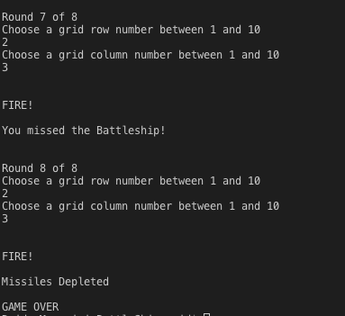

# Battleship Game Console (C# .Net Core, Nunit )

A simple Battleship console application where the user attempts to sink the computer's battleship.

## Summary

This Battleship console app was my first dive into the world of C# and .NET Core.  Coming from a background in Javascript helped me pick up learning pretty quickly as the basic concepts and tools to use in C# are the same: arrays, variables and loops. 

I found the use of models challenging to grasp at first and it helped me understand a lot more about object oriented programming languages.  The use of public and static methods, and building these methods to be testable using the Nunit unit testing framework exposed me to the impotance of designing these methods to be testable and what that means. 

When working through this app, it revealed the ease at which errors are handled with run-time and the strictness at which C# syntax uses and requires in order for the language to compile.  It was also fun getting to test my logic skills and build them at the same time.  

## Playing Directions

The goal of this game is simple.  The player has 8 chances to sink the computer battleship.  You will be prompted to guess a row number and a column number.  If you hit the computer's battleship 5 times, you win!

## Installation Instructions

1.) Open project in VS(Visual Studio or Visual Studio Code)

2.) For VS, open the project and press the play button to launch console.

3.) For VSC, make sure you navigate to `BattleShip` directory and then run `dotnet run` command which will start the game in console.  

## Author 

* **Reid Muchow** - *Front-End Software Developer* - [Website](https://www.reidmuchow.com) | [LinkedIn](https://www.linkedin.com/in/reidmuchow/)